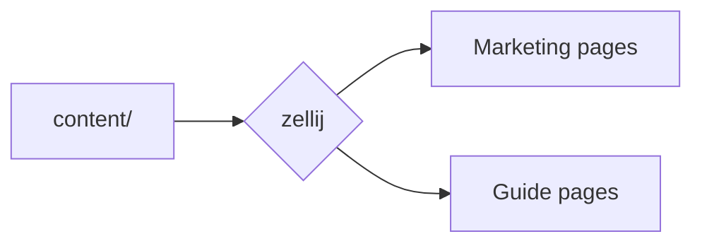
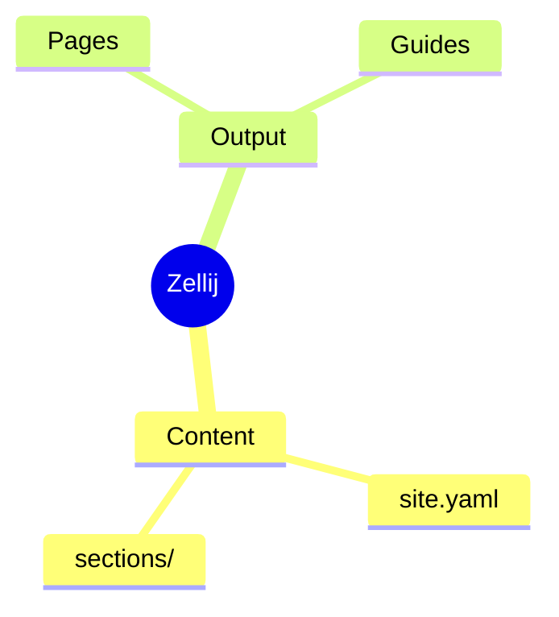
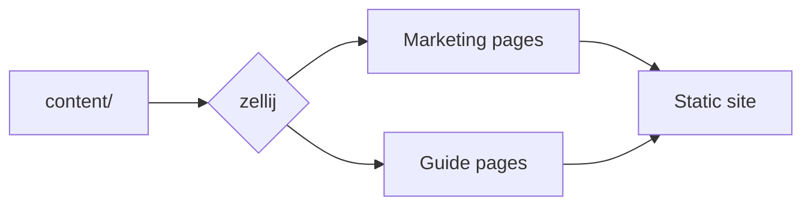
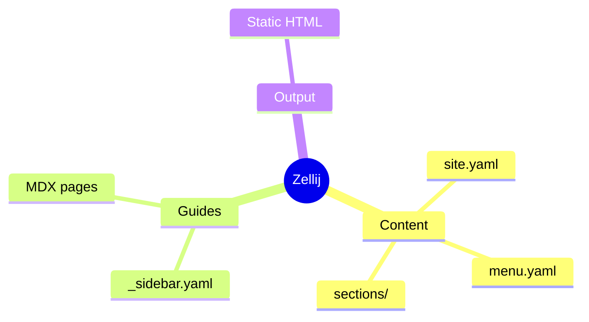
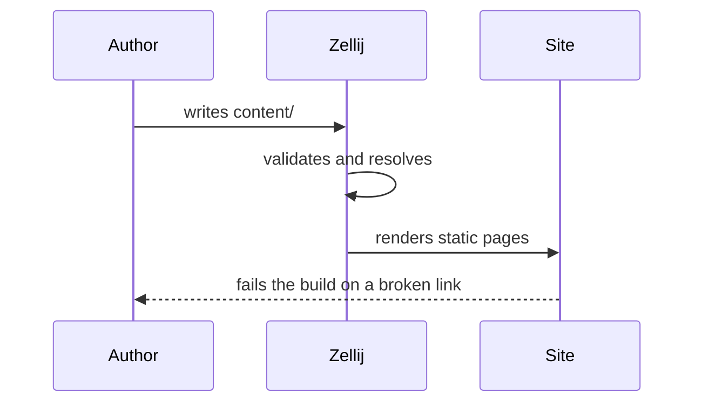
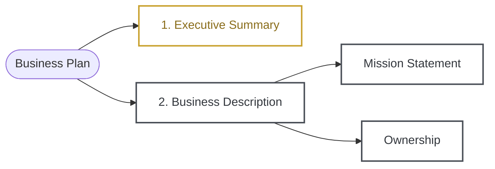
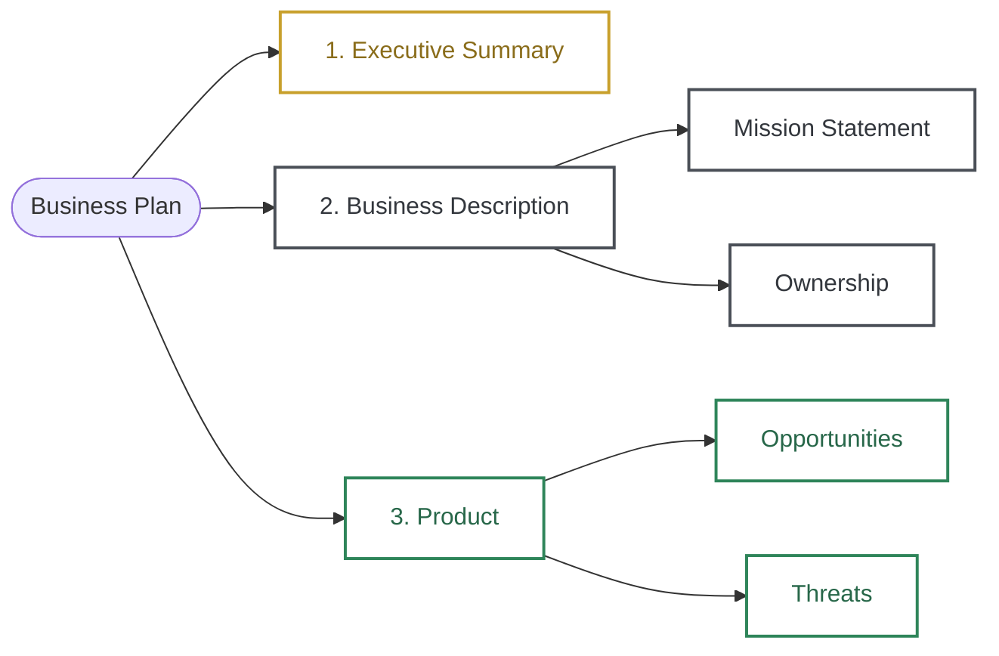

Guide pages carry mathematics and diagrams without any setup: the syntax is
part of the MDX pipeline, and nothing needs enabling in `site.yaml`.

## What each one costs

Maths and diagrams are optional dependencies. A site that does not ask for them
never installs them, and the engine renders without them rather than failing
over a package nobody wanted.

| | Install | Sent to the browser |
| --- | --- | --- |
| Mindmaps | nothing — built in | nothing |
| Maths | ~50 MB | nothing (MathJax typesets to SVG at build time) |
| Mermaid diagrams | ~100 MB | ~10 MB, and only on pages that have one |

Turn them on with `zel build --features maths,diagrams`, or by picking the
container image that has them. Ask for neither and `$…$` stays as written and a
`mermaid` fence renders as its source — which is what a site with no formulas
and no diagrams expects anyway.

## LaTeX

Inline maths goes between single dollars, display maths between double ones.

```md
The sum $\sum_{k=1}^{n} k = \frac{n(n+1)}{2}$ is Gauss's, and in display form:

$$
\int_{-\infty}^{\infty} e^{-x^2}\,dx = \sqrt{\pi}
$$
```

The sum $\sum_{k=1}^{n} k = \frac{n(n+1)}{2}$ is Gauss's, and in display form:

$$
\int_{-\infty}^{\infty} e^{-x^2}\,dx = \sqrt{\pi}
$$

<Callout type="info" title="Rendered at build time, as SVG">
Formulas are typeset by MathJax during the build and shipped as inline SVG.
No maths library reaches the browser, there is no stylesheet to load and no web
fonts to wait for — and because the glyphs are drawn in `currentColor`, a
formula follows the theme into dark mode like any other text.
</Callout>

A wide derivation gets its own scrollbar rather than widening the page:

$$
\left( \sum_{k=1}^{n} a_k b_k \right)^{\!2} \leq \left( \sum_{k=1}^{n} a_k^2 \right) \left( \sum_{k=1}^{n} b_k^2 \right)
$$

## Theorem environments

`<Theorem>` covers the usual environments — `theorem`, `lemma`, `corollary`,
`proposition`, `definition`, `example` and `remark` — and `<Proof>` is the one
you write most often.

```mdx
<Theorem kind="theorem" number="1" title="Cauchy–Schwarz">
For all real $a_k$ and $b_k$, the inequality above holds.
</Theorem>

<Proof>
Consider the quadratic $q(t) = \sum (a_k t - b_k)^2 \geq 0$.
</Proof>
```

<Theorem kind="theorem" number="1" title="Cauchy–Schwarz">
For all real $a_k$ and $b_k$, the inequality above holds, with equality exactly
when the two sequences are proportional.
</Theorem>

<Proof>
Consider $q(t) = \sum_k (a_k t - b_k)^2 \geq 0$. A quadratic that is never
negative has non-positive discriminant, and expanding $q$ gives precisely the
claim.
</Proof>

<Theorem kind="definition" number="1" title="Inner product">
A map $\langle \cdot, \cdot \rangle$ that is linear in its first argument,
symmetric, and positive definite.
</Theorem>

### Numbering is yours

`number` is written, not counted. MDX compiles each page on its own with no
shared render pass, so a counter would restart wherever a component happened to
re-render — and a theorem whose number moves is worse than one with no number.
Omit `number`, or pass `unnumbered`, for a one-off.

## Mermaid diagrams

A `mermaid` fence is drawn rather than highlighted. Every diagram type in the
grammar works, mindmaps included.

<CodeGroup>

````md title="Flowchart"

````

````md title="Mindmap"

````

</CodeGroup>



A mindmap, from the same fence:



And a sequence, since documentation explains protocols more often than it
explains trees:



## Mindmaps

A `mindmap` fence is YAML, and it is drawn during the build rather than in the
browser:

````md
```mindmap
Zellij:
  Content:
    - site.yaml
    - menu.yaml
    - sections/
  Guides: [_sidebar.yaml, MDX pages]
  Output: Static HTML
```
````

```mindmap
Zellij:
  Content:
    - site.yaml
    - menu.yaml
    - sections/
  Guides: [_sidebar.yaml, MDX pages]
  Output: Static HTML
```

A mapping is a node and its children, a list is a set of siblings, and a bare
string is a leaf. That is the whole syntax.

<Callout type="info" title="Nothing runs in the browser">
The layout is arithmetic — a tree of boxes, positioned — so it happens during
the build and the page receives finished SVG. No library is downloaded, nothing
appears after paint, and because the colours are custom properties the drawing
follows a theme change the way text does, rather than having to be drawn again.
</Callout>

A deeper tree stays readable because each column is only as wide as its widest
label:

```mindmap
Documentation:
  Reference:
    Sections:
      - hero
      - bento-grid
    Config:
      - site.yaml
      - menu.yaml
  Guides:
    Getting started:
      - Install
      - First page
  Publishing: [Static, Docker, Netlify]
```

### Colour-coded maps

A mindmap is the quickest way to draw a hierarchy, but its renderer draws no
arrowheads and gives you one colour per branch and no say in which. When the
picture is the point — a structure someone will study rather than glance at —
reach for a flowchart and colour the branches yourself:

````md

````



<Callout type="info" title="Which one to reach for">
`mindmap` costs one line per node and picks its own colours from the theme —
right for a structure you are sketching. A `flowchart` with `classDef` costs
more to write and gives you arrowheads, curve control and the exact palette you
want — right for a diagram that has to carry a page. Colours in a `classDef` are
literal, so unlike everything else in Zellij they do not follow the theme; pick
values that read on a light and a dark background, or keep them for pages where
that does not matter.
</Callout>

<Callout type="tip" title="Only pages with a diagram pay for one">
Mermaid lays a diagram out by measuring text, so it needs a browser and cannot
run during the build the way the maths does. The library is imported the moment
a diagram appears and never otherwise, and until it arrives the fence's source
stands in — so a reader without JavaScript still gets the definition.
</Callout>
